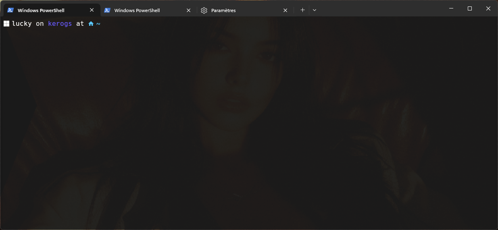

# Windows profile customisation

(background transparent)


## Installation
1. Install [hacker nerd font](https://www.nerdfonts.com/font-downloads)

1. add font in powershell

1. copy colors from ``windows-terminal-settings.json`` in your ``settings.json``

1. install [starship](https://starship.rs/installing/)

1. go to ``~/.config/starship.toml`` (create it if not exist)
    1. Copy ``.starship/starship.toml`` in your  ``~/.config/starship.toml``

6. add starship init
    1. 
    ```sh
    code $PROFILE
    ```
    1. Paste this
    ```ps1
    Invoke-Expression (&starship init powershell)
    ```
