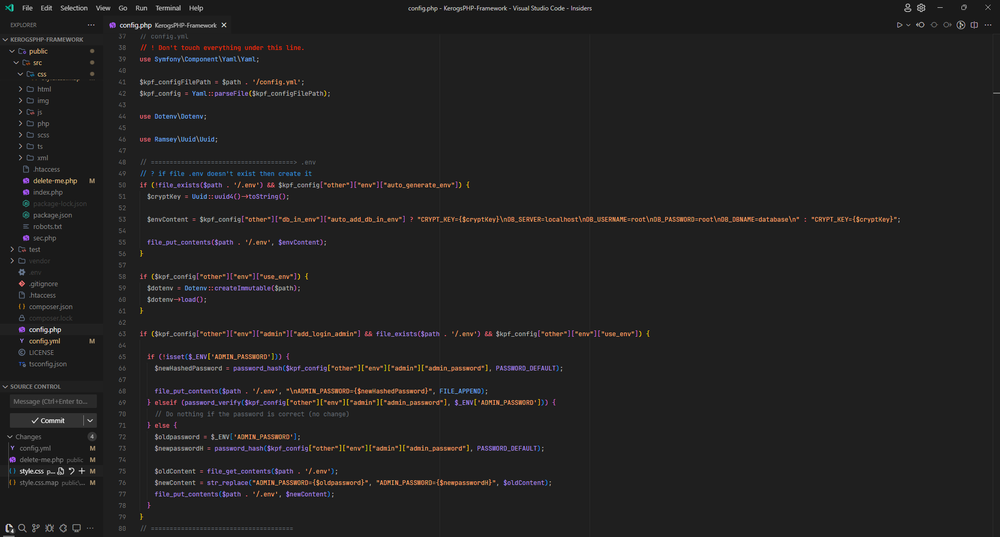

# Installation
Step by Step VSCODE setup

## Fonts
- Install [JetBrains Mono](https://www.jetbrains.com/fr-fr/lp/mono/)
    - (optional) Install [Marianne](https://www.systeme-de-design.gouv.fr/fondamentaux/typographie/)

## Extension

### Theme / icons
- [Min Theme](https://marketplace.visualstudio.com/items?itemName=miguelsolorio.min-theme)
- [Fluent Icons](https://marketplace.visualstudio.com/items?itemName=miguelsolorio.fluent-icons)
- [Symbols](https://marketplace.visualstudio.com/items?itemName=miguelsolorio.symbols)

### Customisation
- [Apc Customize UI++](https://marketplace.visualstudio.com/items?itemName=drcika.apc-extension)

### Code
- [Apache Conf](https://marketplace.visualstudio.com/items?itemName=mrmlnc.vscode-apache)
- [Auto Rename Tag](https://marketplace.visualstudio.com/items?itemName=formulahendry.auto-rename-tag)
- [Better Comments](https://marketplace.visualstudio.com/items?itemName=aaron-bond.better-comments)
- [PHP Extension Pack](https://marketplace.visualstudio.com/items?itemName=xdebug.php-pack)

### Other
- [file-tree-generator](https://marketplace.visualstudio.com/items?itemName=Shinotatwu-DS.file-tree-generator)
- [JSON Crack](https://marketplace.visualstudio.com/items?itemName=AykutSarac.jsoncrack-vscode)
- [Prisma](https://marketplace.visualstudio.com/items?itemName=Prisma.prisma)

### Compiler
- [Live Sass Compiler](https://marketplace.visualstudio.com/items?itemName=glenn2223.live-sass)

### Git
- [Git Graph](https://marketplace.visualstudio.com/items?itemName=mhutchie.git-graph)
- [GitLens](https://marketplace.visualstudio.com/items?itemName=eamodio.gitlens)

## JSON File
1. Press ``f1``.
1. Select ``Preferences: Open user parameters (JSON)``.
1. Copy ``settings.json`` from this repo
1. Paste into open JSON file on VSCODE